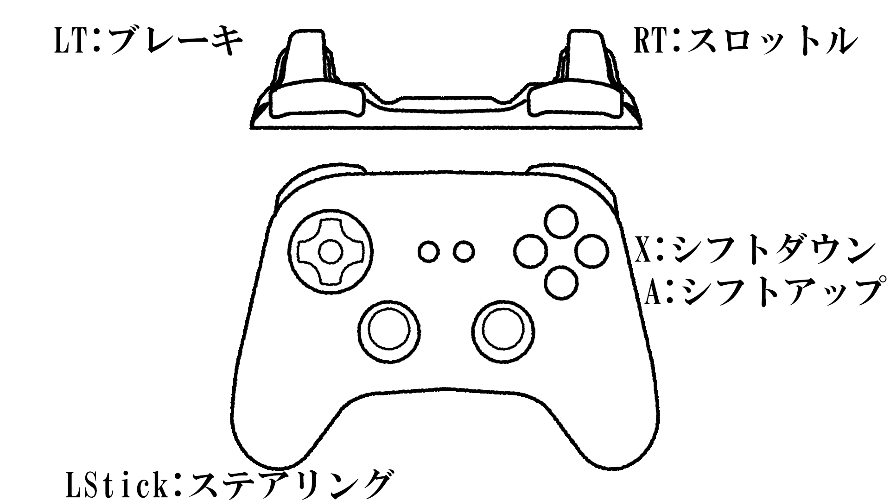
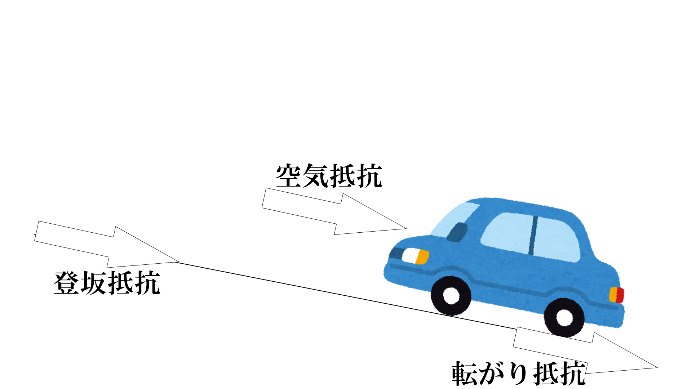
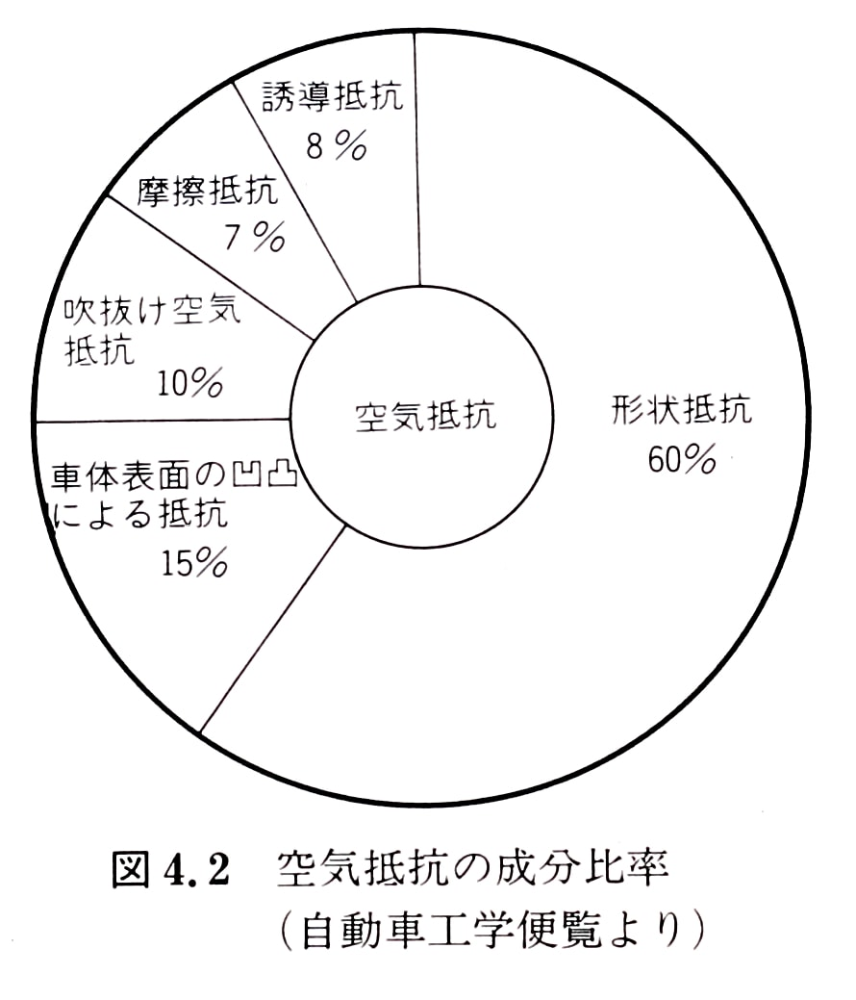
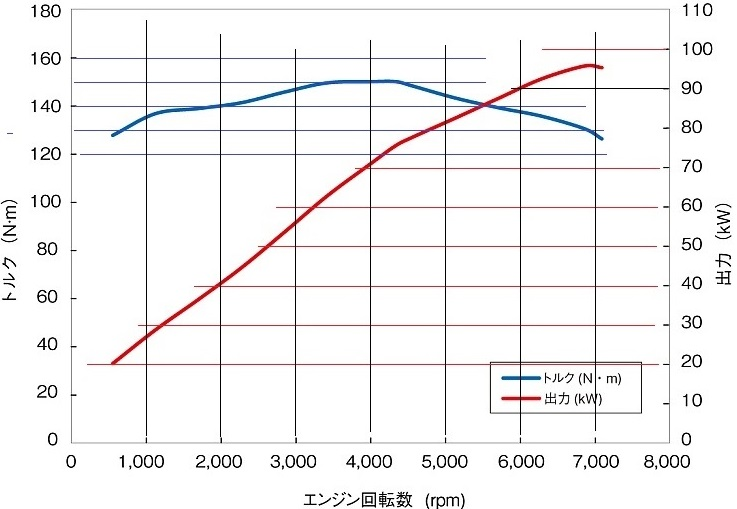

# FormulaGT

## 目次
1. [作品概要](#作品概要)
2. [作成したソースコード](#作成したソースコード)
3. [作成したエンジンコード](#作成したエンジンコード)
4. [ゲーム内容](#ゲーム内容)
5. [操作説明](#操作説明)
6. [技術紹介](#技術紹介)
    * [エンジンについて](#エンジンについて)
7. [今後実装していきたいもの](#今後実装していきたいもの)
8. [引用元](#引用元)

## 作品概要
#### FormulaGT

#### 制作期間
2023年6月~2024年2月

### ゲームジャンル
レースゲーム

#### プレイ人数
1人

####  対応ハード
PC Windows10,11

#### 対応コントローラー
Xbox コントローラー

#### 使用言語
C++
HLSL

#### エンジン
学校内製の簡易エンジン(DirectX12)

#### IDE
Visual Studio 2022

#### 3Dモデリング
3DS MAX

#### 画像
Adobe Photoshop

#### バージョン管理
GItHub
<br>Fork

## 作成したソースコード
BackGround.cpp
<br>BackGround.h
<br>Car_AE86.cpp
<br>Car_AE86.h
<br>Car_Oreca07.cpp
<br>Car_Oreca07.h
<br>Car_RB6.cpp
<br>Car_RB6.h
<br>CarAFormula.cpp
<br>CarAFormula.h
<br>CarBase.cpp
<br>CarBase.h
<br>CarData.h
<br>FrontWheelBase.cpp
<br>FrontWheelBase.h
<br>GameCamera.cpp
<br>GameCamera.h
<br>LeftFrontWheel.cpp
<br>LeftFrontWheel.h
<br>LeftRearWheel.cpp
<br>LeftRearWheel.h
<br>Lighting.cpp
<br>Lighting.h
<br>MainRaceManager.cpp
<br>MainRaceManager.h
<br>Menu.cpp
<br>Menu.h
<br>MyGarage.cpp
<br>MyGarage.h
<br>RaceMenu.cpp
<br>RaceMenu.h
<br>RightFrontWheel.cpp
<br>RightFrontWheel.h
<br>RightRearWheel.cpp
<br>RightRearWheel.h
<br>Test.cpp
<br>Test.h
<br>TimeTrialMode.cpp
<br>TimeTrialMode.h
<br>Title.cpp
<br>Title.h
<br>WorldMode.cpp
<br>WorldMode.h

## 作成したエンジンコード
Bloom.cpp
<br>Bloom.h
<br>Depth_of_Field.cpp
<br>Depth_of_Field.h
<br>FontRender.cpp
<br>FontRender.h
<br>LevelRender.cpp
<br>LevelRender.h
<br>ModelRender.cpp
<br>ModelRender.h
<br>RenderingEngine.cpp
<br>RenderingEngine.h
<br>SceneLight.cpp
<br>SceneLight.h
<br>SkyCube.cpp
<br>SkyCube.h
<br>SpriteRender.cpp
<br>SpriteRender.h
<br>gaussianBlur.fx
<br>model.fx
<br>PostEffect.fx
<br>sampleDrawShadowMap.fx
<br>shadowReciever.fx
<br>SkyCubeMap.fx
<br>sprite.fx
<br>ZPrepass.fx

## ゲーム内容
自動車を走らせてタイムアタックするゲーム
## 操作説明

## 技術紹介
### エンジン
#### 1.各種抵抗の計算
自動車には常にいろいろな抵抗がかかっている.
<br>その中でも、代表的な空気抵抗・転がり抵抗・登坂抵抗の三種類に加え、ブレーキによる抵抗を合わせて各種抵抗としている.

また、ギア比による抵抗の変化も存在しているため、タイヤの半径をギア比とデファレンシャル比で割ったものを前述の抵抗に割っている.

$$ Resistance=(Faero+Fr+Fgrade+Fbrake)\times\displaystyle\frac{TireRadius}{GearRatio\times DifferentialRatio\times 0.95}$$ 

<br>

$$Resistance:抵抗$$ 
$$Faero:空気抵抗$$ 
$$Fr:転がり抵抗$$ 
$$Fgrade:登坂抵抗$$ 
$$Fbrake:ブレーキ$$ 
$$TireRadius:タイヤ半径$$ 
$$GearRatio:ギア比$$ 
$$DifferentialRatio:デファレンシャル比$$ 
* * *
#### 各種抵抗の計算
#### 空気抵抗
空気抵抗は以下のような要素で構成されている.

これを単純化すると以下のような計算式になる.

$$ Faero=0.5\times Cd\times FrontProjectedArea \times ρ \times v^2 $$ 

<br>

$$Faero:空気抵抗$$ 

$$Cd:ドラッグ係数$$ 

$$FrontProjectedArea:正面投影面積$$ 

$$ρ:空気の密度 $$ 

$$v:進行方向における自動車の空気に対する相対速度 $$ 

空気の密度は以下の式で計算できる．
<br>ちなみに 0℃，1 atm の状況での空気の密度 ρ は 1.293 kg/m3である．

$$ ρ=\displaystyle\frac{1.293\times AtmosphericPressure}{1 + Temperature ÷ 273.15}\times (1-\displaystyle\frac{0.378\times WaterVaporPressure}{AtmosphericPressure}) $$

<br>

$$ρ:空気の密度 $$ 

$$AtmosphericPressure:大気圧$$ 

$$Temperature:気温$$ 

$$WaterVaporPressure:水蒸気圧$$ 

ドラッグ係数は、おおよその自動車の平均である、0.3を使用.
<br>正面投影面は、トレッド幅×全高で計算されている.

* * *
#### 転がり抵抗
転がり抵抗は，タイヤの変形，路面の凸凹，タイヤが路面上を部分的に滑るためにおこる摩擦などによって引き起こされる．
<br>これを計算するのは困難なので，以下のような計算で求めている.

$$ Fr=μ\times mass\times g $$

<br>

$$Fr:転がり抵抗 $$ 

$$μ:転がり抵抗係数$$ 

$$mass:車両重量$$ 

$$g:重力加速度$$ 

転がり抵抗係数は、アスファルトの0.015としている.
* * *
#### 登坂抵抗
登坂抵抗は、以下のような計算で求めている.

$$ Fgrade=mass\times g\times \sin(θ) $$

<br>

$$Fgrade:登坂抵抗 $$ 

$$mass:車両重量$$ 

$$g:重力加速度$$ 

$$θ:勾配$$ 

* * *
#### ブレーキによる抵抗
ブレーキは、ブレーキペダルの踏み込み度合いにより変化するため以下のような計算で求めている.

$$ Fbrake=MaximumBrakingForce\times BrakePressure$$

<br>

$$Fbrake:ブレーキ $$ 

$$MaximumBrakingForce:最大制動力$$ 

$$BrakePressure:ブレーキペダルの踏み込み度合い$$ 

* * *

また、抵抗の単位はN(ニュートン)である.
<br>しかし、トルクの単位はNm(ニュートン毎メートル)のため、変換が必要である.
<br>そのため、すべて抵抗に対してタイヤ半径を乗算している.

* * *
#### 2.エンジントルク
エンジントルクは、トルクカーブから引用してきます.
<br>トルクカーブとは、パワーカーブと合わせてエンジンの特性を表したグラフで、ある回転数でどのくらいのトルクが出ているのかを視覚化したものである.

<br>しかし、トルクカーブは、一定の回転数からでしか、きれいに引用することはできない.
<br>そのため、今回は、線形補完をすることで、各回転数でのトルクの引用を行っている.

```C++
//トルクカーブ情報をごとに線形補完する関数
float EngineTorque(float rpm, std::vector<std::vector<float>> data) {
    int i = 0;
    while (data[i][0] <= rpm) {
        i++;
        if (i == 40) {
            break;
        }
    }

    float t = data[i - 1][1] + ((rpm - data[i - 1][0]) * (data[i][1] - data[i - 1][1])) / (data[i][0] - data[i - 1][0]);

    return t;
}
```

また、エンジントルクはアクセル開度に影響されるため、上記のコードで算出されたエンジントルクにアクセル開度を乗算している.
<br>このエンジントルクから、１で算出した抵抗を引くことで、実トルクを求めている.
***

#### 3.エンジン回転数
エンジントルクからエンジン回転数の計算を行うため以下の計算で求めている.

$$ Evel+=\displaystyle\frac{T}{l\times dt} $$ 

$$ Erpm=Evel\times \displaystyle\frac{60}{2÷ π}$$

<br>

$$E_Vel:エンジンの角速度 $$ 

$$T:エンジントルク$$ 

$$l:慣性モーメント$$ 

$$ dt:微小時間 $$ 

しかし、シフトチェンジの際、エンジン回転数がおかしくなる問題が生じたため、シフトチェンジ時のみ以下の計算式を適応している.

$$ Ntire= \displaystyle\frac{VelocityVector}{2π\times TireRadius}\times 60$$ 

$$ RPM=Ntire\times GearRatio\times DifferentialRatio $$ 


$$Ntire:タイヤ回転数$$ 

$$VelocityVector:速度$$ 

$$RPM:エンジン回転数$$ 

$$TireRadius:タイヤ半径$$ 

$$GearRatio:ギア比$$ 

$$DifferentialRatio:デファレンシャル比$$ 

***
#### 4.速度
3で求めたエンジン回転数をもとに、速度を求める.
<br>一般的な単位はm/sであるが、今回はcm/sとして計算する.
<br>また、モデルのスケールの関係上スケールスピード0.4として計算する.

$$ Velocity=\displaystyle\frac{RPM}{(60\times GearRatio\times DifferentialRatio)\times (TireRadius\times 2π)\times 0.4\times 100} $$ 


## 今後実装していきたいもの
### 車両運動モデルの実装
現状のコードでは、エンジンのコードのみで足回りのコードがない.
<br>その理由としては、足回りのコードは非常に複雑ですべて理解し、再現しきるには時間が足りない.
<br>そのため、車両運動モデルと言われる、車両の動きを数学的に表現したものを実装することを考えている.

### ゲーム的要素の追加
現状、車両のエンジンを再現するという技術的な側面が強い作品となっている.
<br>そのため、今後ゲーム的要素を増やし、ゲームとしての完成度を高めていくことを考えている.

### グラフィックの強化
現状基本的なグラフィックの表現しかできていないため、PBR等のグラフィックの技術の実装を行い、映像としての強化を考えている.

## 引用元
https://dskjal.com/car/car-physics-for-simulator.html#rr

http://www-cdr.stanford.edu/dynamic/WheelSlip/SlmillerGerdesACC.pdf

https://nikawa-niwaka.net/entry/386

https://vehicle-cafeteria.com/T05TorqueHorsePower.html

https://www.asawicki.info/Mirror/Car%20Physics%20for%20Games/Car%20Physics%20for%20Games.html

https://www.scribd.com/document/63960588/VehicleDynamicsForRacingGames-1

